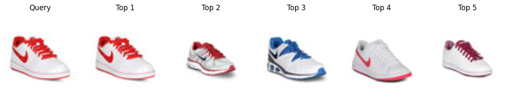
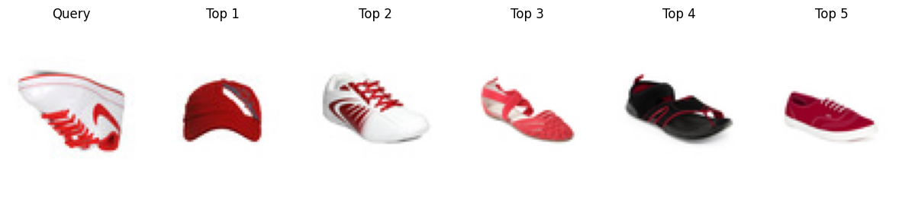

 
 <h2 align="center">Image Visual Search - Voxel51 Meetup</h2>
 
<b>Crea tu primer Visual Search desde cero</b>

  

    
        
    

## 1) Dataset

Se utilizó el dataset de Kaggle: [Fashion product images](https://www.kaggle.com/datasets/paramaggarwal/fashion-product-images-small).

Contiene **44.441** imágenes de prendas de ropa, donde aparece una prenda de interés por imagen.

## 2) Pipeline
- Los embeddings se obtienen a partir de la **Resnet50** (sin la última capa de clasificación).
- Se utilizo el **redimensionamiento y normalización** como operaciones de **transformación**.
- Se utilizo **FAISS** como base de datos vectorial y **L2** como índice de similitud.
- Para la búsqueda se consideran **las primeros 5 imágenes parecidas**.

## 3) Ejemplo

Top 5 de imágenes similares.

## 4) Aspectos de mejora adicional
- Agregar una **etapa de detección de objetos**: en caso que la imagen contenga muchas prendas.
- Agregar una **etapa de segmentación** para remover el fondo: de esta manera el fondo no afecta el resultado.
- Utilizar más información (tipo de prenda, colores, etc) para convertirlo en un **Product Visual Search**.
- Alternativas de **base de datos vectoriales**: [Annoy](https://github.com/spotify/annoy), [Qdrant](https://qdrant.tech/), [Weaviate](https://weaviate.io/), etc.
- **Soluciones con Voxel51**: [DINOv3 visual search](https://docs.voxel51.com/tutorials/dinov3.html) y [VoxelGPT](https://github.com/voxel51/voxelgpt).

## 5) Contacto

- Linkedin: [Carlos Bustillo](https://www.linkedin.com/in/carlos-bustillo/)
- Mail: cabustillo13@hotmail.com
